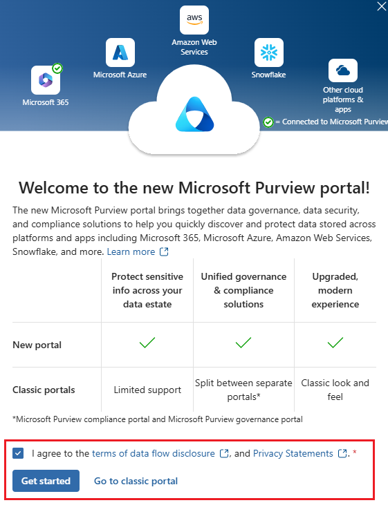

---
lab:
  task: Configure Retention Policies
  exercise: Exercise 1 - Configure Retention Policies
---

## Locataires WWL - Conditions d’utilisation

Si un locataire vous est fourni dans le cadre d’une formation dispensée par un instructeur, notez qu’il est mis à votre disposition dans le seul but de prendre en charge les labos pratiques de la formation.

Vous ne devez ni partager ni utiliser les locataires en dehors des labos pratiques. Le locataire utilisé dans ce cours est un locataire d’essai. Au terme de la classe, le locataire ne pourra pas faire l’objet d’une prolongation et vous ne pourrez plus l’utiliser ni y accéder.

Vous n’êtes pas autorisé à convertir un locataire en abonnement payant. Les locataires obtenus dans le cadre de ce cours sont la propriété de Microsoft Corporation. Nous nous réservons le droit d’y accéder et d’en reprendre possession à tout moment.

# Tâches associées à la compétence de l’exercice 1

Votre tâche consiste à créer et gérer des stratégies de rétention qui respectent les critères requis :

- **Stratégie de rétention à l’échelle de l’entreprise** : appliquez une période de rétention et définissez les emplacements de cette stratégie.
- **Stratégies de rétention basées sur l’emplacement** : créez des stratégies de rétention pour des emplacements spécifiques, tels que des canaux et des conversations Teams, utilisateurs spécifiques compris.
- **Stratégies de rétention PowerShell** : implémentez des stratégies de rétention à l’aide de PowerShell.
- **Stratégies d’étendue adaptative** : créez et appliquez des stratégies de rétention avec des étendues adaptatives pour les services tels que le service juridique et les points de vente.

## Tâche 1 : créer une stratégie de rétention à l’échelle de l’entreprise

Ici, vous allez créer une stratégie de rétention qui s’applique à l’ensemble de l’organisation.

1. Dans Microsoft Edge, accédez au portail Microsoft Purview, `https://purview.microsoft.com`, et connectez-vous.
1. Un message à propos du nouveau portail Microsoft Purview s’affiche à l’écran. Sélectionnez l’option permettant d’accepter les conditions de divulgation de flux de données et la déclaration de confidentialité, puis sélectionnez **Démarrer**.

    >

1. Sélectionnez **Solutions** > **Gestion du cycle de vie des données**.
1. Développez **Stratégies**, puis sélectionnez **Stratégies de rétention** dans le volet de navigation de gauche.
1. Sélectionnez **+ Nouvelle stratégie de rétention**.
1. Sur la page **Nommer votre stratégie de rétention**, saisissez le nom et la description :

   - **Nom :** `Company wide`
   - **Description** : `All locations except for teams`

1. Cliquez sur **Suivant**.
1. Sur la page **Étendue de la stratégie**, sélectionnez **Suivant**.
1. Sur la page **Choisir le type de stratégie de rétention à créer**, sélectionnez **Statique**, puis **Suivant**.
1. Sur la page **Choisir où appliquer cette stratégie**, activez :

   - Les boîtes aux lettres Exchange
   - Sites classiques et de communication SharePoint
   - Comptes OneDrive
   - Boîtes aux lettres de groupe et sites Microsoft 365

1. Cliquez sur **Suivant**.
1. Sur la page **Décider si vous voulez conserver du contenu, le supprimer ou les deux**, pour la section **Conserver les éléments pendant une période spécifique**, saisissez les informations suivantes :

   - **Conserver les éléments pendant une période spécifique** : choisissez **Personnalisé** dans la liste déroulante
   - Définissez le champ des années sur **3**
   - **Démarrer la période de rétention en fonction de** : Quand les éléments ont été modifiés pour la dernière fois
   - **À la fin de la période de rétention** : Supprimer automatiquement les éléments

1. Cliquez sur **Suivant**.
1. Sur la page **Vérifier et terminer**, sélectionnez **Envoyer**.
1. Une fois votre stratégie créée, sélectionnez **Terminé**.

Vous avez créé une stratégie de rétention à l’échelle de l’entreprise qui conserve les éléments pendant trois ans à partir de la date de la dernière modification.

## Tâche 2 : créer des stratégies de rétention basées sur l’emplacement avec filtre

Ici, vous allez créer des stratégies de rétention spécifiquement pour les canaux et conversations Teams, filtres d’utilisateurs spécifiques compris.

1. Vous devriez toujours être sur l’écran **Stratégies de rétention** dans le portail Microsoft Purview.

   Si ce n’est pas le cas, dans Microsoft Edge, accédez au portail Microsoft Purview, `https://purview.microsoft.com`, et connectez-vous. Une fois connecté, sélectionnez la carte **Gestion du cycle de vie des données** > **Stratégies** > **Stratégies de rétention**.

1. Sélectionnez **+ Nouvelle stratégie de rétention**.
1. Sur la page **Nommer votre stratégie de rétention**, saisissez le nom et la description :

   - **Nom :** `Teams Retention`
   - **Description** : `Retention for Teams locations`

1. Cliquez sur **Suivant**.
1. Sur la page **Étendue de la stratégie**, sélectionnez **Suivant**.
1. Sur la page **Choisir le type de stratégie de rétention à créer**, sélectionnez **Statique**, puis **Suivant**.
1. Dans la section Choisir les emplacements pour appliquer la stratégie, activez :

   - Messages des canaux Teams
   - Conversations Teams et interactions Copilot

   Vérifiez que toutes les autres options sont désactivées.

1. Pour l’emplacement **Conversations Teams et interactions Copilot**, sélectionnez le lien **Modifier** sous **Tous les utilisateurs** et ajoutez deux utilisateurs.

    >

1. Sur la page volante **Conversations Teams et interactions Copilot**, une fois que les utilisateurs sont ajoutés, sélectionnez **Terminé**, puis **Suivant**.
1. Sur la page **Décider si vous voulez conserver du contenu, le supprimer ou les deux**, saisissez :
   - **Conserver les éléments pendant une période spécifique** : choisissez **Personnalisé** dans la liste déroulante.
   - Définissez le champ des années sur 3.
   - **Démarrer la période de rétention en fonction de** : Quand les éléments ont été modifiés pour la dernière fois.

1. Cliquez sur **Suivant**.
1. Sur la page **Vérifier et terminer**, sélectionnez **Envoyer**.
1. Une fois votre stratégie créée, sélectionnez **Terminé**.

Vous avez créé une stratégie de rétention pour les emplacements Teams avec une période de rétention de trois ans, en appliquant un filtre pour des utilisateurs spécifiques.

## Tâche 3 : créer une stratégie de rétention via PowerShell

Dans cette tâche, vous allez utiliser PowerShell pour créer et gérer des stratégies de rétention.

1. Ouvrez une fenêtre PowerShell avec des privilèges élevés.
1. Saisissez la cmdlet suivante pour installer la dernière version du module PowerShell Exchange Online :

    ```powershell
    Install-Module ExchangeOnlineManagement
    ```

1. Confirmez la boîte de dialogue de sécurité du fournisseur NuGet en appuyant sur **Y** pour Oui, puis appuyez sur **Entrée**. Ce processus peut prendre un certain temps.
1. Confirmez la boîte de dialogue de sécurité du référentiel non approuvé en appuyant sur **Y** pour Oui, puis appuyez sur **Entrée**.  Ce processus peut prendre un certain temps.
1. Saisissez la cmdlet suivante pour modifier votre stratégie d’exécution, puis appuyez sur **Entrée**. La commande suppose que vous êtes connecté en tant qu’utilisateur disposant des autorisations appropriées.

    ```powershell
    Set-ExecutionPolicy -ExecutionPolicy RemoteSigned -Scope CurrentUser
    ```

1. Confirmez les modifications de la stratégie d’exécution en appuyant sur **Y** pour Oui, puis appuyez sur **Entrée**.
1. Fermez la fenêtre PowerShell.
1. Ouvrez une fenêtre PowerShell normale, sans élévation, en sélectionnant le bouton Windows avec le bouton droit de la souris et en sélectionnant **Windows PowerShell**.
1. Connectez-vous au Centre de sécurité et de conformité dans votre locataire avec la cmdlet suivante :

    ```powershell
    Connect-IPPSSession
    ```

1. Lorsque vous y êtes invité, connectez-vous en tant qu’utilisateur disposant des autorisations appropriées.
1. Exécutez la cmdlet suivante pour créer la première stratégie de rétention pour tous les emplacements à l’exception de Teams :

    ```powershell
    New-RetentionCompliancePolicy -Name "Company Wide PS" -ExchangeLocation All -ModernGroupLocation All -SharePointLocation All -OneDriveLocation All
    ```

1. Exécutez la cmdlet suivante pour définir la période de rétention, en utilisant les jours comme unités selon la date de modification :

    ```powershell
    New-RetentionComplianceRule -Name "Company Wide PS Rule" -Policy "Company Wide PS" -RetentionDuration 1095 -ExpirationDateOption ModificationAgeInDays -RetentionComplianceAction Keep
    ```

Vous avez créé des stratégies de rétention via PowerShell avec une période de rétention de trois ans.

## Tâche 4 : créer une stratégie de conservation avec une étendue adaptative

Ici, vous allez créer une stratégie de rétention avec une étendue adaptative ciblant des services spécifiques tels que le service juridique et les points de vente.

1. Dans Microsoft Edge, accédez au portail Microsoft Purview, `https://purview.microsoft.com`, et connectez-vous.
1. Dans la barre de navigation gauche, sélectionnez **Paramètres**.
1. Développez **Rôles et étendues**, puis sélectionnez **Étendues adaptatives**.
1. Sur la page **Étendues adaptatives**, sélectionnez **+ Créer une étendue**.
1. Sur la page **Nommer votre étendue de stratégie adaptative**, saisissez :

   - **Nom :** `Legal Documents Retention`
   - **Description** : `Retention for legal related documents`

1. Cliquez sur **Suivant**.
1. Sur la page **Attribuer une unité d’administration**, sélectionnez **Suivant**.
1. Sur la page **Quel type d’étendue voulez-vous créer ?**, sélectionnez **Utilisateurs**, puis **Suivant**.
1. Sur la page **Créer la requête pour définir les utilisateurs**, sous **Attributs utilisateur**, sélectionnez :

   - **Attribut** : Department
   - **Opérateur** : Est égal à
   - **Valeur** : `Legal`

1. Ajoutez un deuxième attribut en sélectionnant le bouton **+ Ajouter un attribut** avec les valeurs :

   - **Opérateur de requête** : Ou
   - **Attribut** : Department
   - **Opérateur** : Est égal à
   - **Valeur** : `Retail`

    >

1. Sélectionnez **Suivant**, puis **Envoyer** sur la page **Examiner et terminer**.
1. Une fois votre étendue créée, sélectionnez **Terminé** pour revenir à la page **Étendues adaptatives**.
1. Sélectionnez **Solutions** > **Gestion du cycle de vie des données**.
1. Développez **Stratégies**, puis sélectionnez **Stratégies de rétention**.
1. Sur la page **Stratégies de rétention**, sélectionnez **+ Nouvelle stratégie de rétention**.
1. Sur la page **Nommer votre stratégie de rétention**, saisissez :

   - **Nom :** `Legal Data Retention`
   - **Description** : `Retention of all documents within the legal and retail departments.`

1. Cliquez sur **Suivant**.
1. Sur la page **Étendue de la stratégie**, sélectionnez **Suivant**.
1. Sur la page **Choisir le type de stratégie de rétention à créer**, sélectionnez **Adaptative**, puis **Suivant**.
1. Sur la page **Choisir des étendues et emplacements de stratégie adaptative**, sélectionnez **+ Ajouter des étendues** et choisissez l’étendue **Rétention des documents juridiques**.
1. Sous **Choisir les emplacements pour appliquer la stratégie**, activez :

   - Boîtes aux lettres Exchange
   - Comptes OneDrive

1. Cliquez sur **Suivant**.
1. Sur la page **Décider si vous voulez conserver du contenu, le supprimer ou les deux**, saisissez :

   - **Conserver les éléments pendant une période spécifique** : 5 ans
   - **Démarrer la période de rétention en fonction de** : Quand les éléments ont été créés
   - **À la fin de la période de rétention** : Ne rien faire

1. Sélectionnez **Suivant** puis **Envoyer** sur la page **Vérifier et terminer**.
1. Une fois votre stratégie créée, sélectionnez **Terminé**.

Vous avez appliqué une étendue adaptative à une stratégie de rétention.
