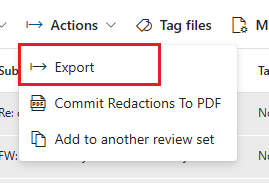

---
lab:
  task: Case investigation with eDiscovery (Premium)
  exercise: Exercise 3 - Case investigation with eDiscovery (Premium)
---

## Locataires WWL - Conditions d’utilisation

Si un locataire vous est fourni dans le cadre d’une formation dispensée par un instructeur, notez qu’il est mis à votre disposition dans le seul but de prendre en charge les labos pratiques de la formation.

Vous ne devez ni partager ni utiliser les locataires en dehors des labos pratiques. Le locataire utilisé dans ce cours est un locataire d’essai. Au terme de la classe, le locataire ne pourra pas faire l’objet d’une prolongation et vous ne pourrez plus l’utiliser ni y accéder.

Vous n’êtes pas autorisé à convertir un locataire en abonnement payant. Les locataires obtenus dans le cadre de ce cours sont la propriété de Microsoft Corporation. Nous nous réservons le droit d’y accéder et d’en reprendre possession à tout moment.

# Tâches associées à la compétence de l’exercice 3

Votre tâche consiste à créer et gérer des cas eDiscovery qui respectent les critères d’enquête :

- **Créer un cas eDiscovery** : configurez un nouveau cas pour commencer votre enquête.
- **Ajouter des consignataires au cas** : incluez les personnes concernées qui peuvent avoir des données pertinentes.
- **Créer et exécuter une estimation de collection** : analysez le volume de données et la pertinence de l’enquête.
- **Vérifier et affiner l’estimation de collection** : vérifiez que la collection répond à vos critères.
- **Valider la collection dans un jeu à réviser** : préparez les données pour une analyse détaillée.
- **Exporter les résultats de la recherche** : enregistrez les données collectées à des fins de révision supplémentaire et de conformité.

>**Remarque** : ce labo implique d’accéder à un locataire M365 E5 avec des données à explorer pour mener une enquête. Vous pouvez parcourir cet exercice sans données, mais les collections et les jeux à réviser ne donneront aucun résultat.

## Tâche 1 : accorder des autorisations pour eDiscovery (Premium)

Pour exporter des fichiers, vous avez besoin d’autorisations spécifiques en raison de l’accès direct que cette option octroie sur les fichiers utilisateur.

1. Dans Microsoft Edge, accédez au portail Microsoft Purview, `https://purview.microsoft.com`, et connectez-vous.
1. Sélectionnez la carte **Paramètres**.

   Si vous ne voyez pas la carte **Paramètres**, sélectionnez **Afficher toutes les solutions** et la carte **Paramètres** sous la section **Core**.

1. Dans le volet de navigation de gauche, développez **Rôles et étendues**, puis sélectionnez **Groupes de rôles**.
1. Sur la page **Groupes de rôles pour les solutions Microsoft Purview**, sélectionnez **Gestionnaire eDiscovery**.
1. Sur la page volante **Gestionnaire eDiscovery** à droite, sélectionnez **Modifier**.
1. Sur la page **Gérer le Gestionnaire eDiscovery**, sélectionnez **Choisir des utilisateurs**.
1. Sur la page volante **Choisir des utilisateurs** à droite, sélectionnez l’utilisateur que vous utiliserez pour effectuer cet exercice interactif, puis **Sélectionner**.
1. De retour sur la page **Gérer le Gestionnaire eDiscovery**, sélectionnez **Suivant**.
1. Sur la page **Gérer le Gestionnaire eDiscovery**, sélectionnez **Suivant**.
1. Sur la page **Vérifier le groupe de rôles et terminer**, sélectionnez **Enregistrer** pour ajouter votre utilisateur au groupe de rôles Gestionnaire eDiscovery.
1. Une fois que vous avez ajouté les utilisateurs, sélectionnez **Terminé** sur la page **Vous avez mis à jour le groupe de rôles**.
1. Sélectionnez **Accueil** pour revenir à la page d’accueil du portail Microsoft Purview.

Vous avez accordé l’autorisation Gestionnaire eDiscovery.

## Tâche 2 : créer un cas eDiscovery (Premium)

Maintenant que vous disposez des autorisations nécessaires, vous pouvez créer un cas eDiscovery pour commencer votre enquête.

1. Vous devriez être sur la page d’accueil du portail Microsoft Purview.

   Si ce n’est pas le cas, dans Microsoft Edge, accédez au portail Microsoft Purview, `https://purview.microsoft.com`, et connectez-vous.

1. Sélectionnez **Afficher toutes les solutions**.
1. Sous **Risque et Conformité**, sélectionnez la carte **eDiscovery**.
1. Dans le volet de navigation gauche, développez **Cas Premium**, puis sélectionnez **Cas**.
1. Sur la page **eDiscovery (Premium)**, sélectionnez **+ Créer un cas**.
1. Sur la page volante **Nommer votre cas** à droite, saisissez :

   - **Nom :** `Legal Investigation 2024`
   - **Description** : `eDiscovery case for the 2024 legal investigation involving relevant emails and documents.`

1. Sur la page **Ajouter des membres de l’équipe et configurer les paramètres**, veillez à ajouter l’utilisateur qui mènera l’enquête, puis sélectionnez **Suivant**.
1. Sur la page **Vérifier votre cas**, sélectionnez **Envoyer**, puis **Terminé**.

Vous avez créé un cas eDiscovery nommé _Legal Investigation 2024_.

## Tâche 3 : ajouter des consignataires au cas

Maintenant que votre cas est créé, vous devez ajouter des consignataires. Les consignataires sont des personnes qui peuvent disposer d’informations pertinentes pour l’enquête.

1. Après avoir créé le cas dans la tâche précédente, vous devriez être dans l’onglet **Vue d’ensemble** du cas **Legal Investigation 2024**.

   Si ce n’est pas le cas, dans Microsoft Edge, accédez au portail Microsoft Purview, `https://purview.microsoft.com`, et connectez-vous. Sélectionnez la carte **eDiscovery** sous la section **Risque et Conformité**. Sélectionnez **Cas Premium** > **Cas**, puis le nouveau cas créé **Legal Investigation 2024**.

1. Sélectionnez l’onglet **Sources de données** dans la navigation supérieure, puis **Ajouter une source de données** > **Ajouter de nouveaux consignataires**.
1. Sur la page volante **Nouveau consignataire**, sous **Sélectionner le consignataire**, ajoutez des consignataires à votre cas, puis sélectionnez **Suivant**.
1. Sur la page **Paramètres de conservation**, vérifiez que les consignataires que vous avez ajoutés à l’étape précédente sont sélectionnés pour être placés en conservation.
1. Sur la page **Examiner vos consignataires**, sélectionnez **Envoyer**, puis **Terminé** une fois que vos nouveaux consignataires sont créés.

Vous avez ajouté des consignataires au cas _Legal Investigation 2024_.

## Tâche 4 : créer et exécuter une estimation de collection

Avec les consignataires ajoutés, vous pouvez maintenant exécuter une estimation de collection pour obtenir une vue d’ensemble du volume de données et de la pertinence.

1. Après avoir ajouté des consignataires au cas dans la tâche précédente, vous devriez toujours être dans l’onglet **Sources de données** du cas **Legal Investigation 2024**.  

   Si ce n’est pas le cas, dans Microsoft Edge, accédez au portail Microsoft Purview, `https://purview.microsoft.com`, et connectez-vous. Sélectionnez la carte **eDiscovery** sous la section **Risque et Conformité**. Sélectionnez **Cas Premium** > **Cas**, puis le nouveau cas créé **Legal Investigation 2024**.

1. Sélectionnez l’onglet **Collections** dans la navigation supérieure, puis **+ Nouvelle collection**.
1. Dans la configuration de **Nouvelle collection**, saisissez **un nom et une description** pour la collection. Entrez :

   - **Nom :** `Legal Data Collection`
   - **Description** : `Collecting emails and documents relevant to the 2024 legal investigation.`

1. Cliquez sur **Suivant**.
1. Sur la page **Choisir des sources de données consignataires**, sélectionnez **+ Sélectionner des consignataires**.
1. Sur la page volante **Sélectionner des consignataires** à droite, ajoutez les consignataires qui ont été ajoutés au cas dans la tâche précédente, puis sélectionnez **Ajouter**.
1. De retour sur la page **Choisir des sources de données consignataires**, sélectionnez **Suivant**.
1. Sur la page **Choisir des sources de données non consignataires**, sélectionnez **Suivant**.
1. Sur la page **Emplacements supplémentaires**, définissez l’état sur **Activé** pour ces emplacements :

   - Boîtes aux lettres Exchange
   - Dossiers publics Exchange

1. Cliquez sur **Suivant**.
1. Sur la page **Définir votre requête de recherche**, utilisez le générateur de requêtes pour créer une recherche afin de rechercher du contenu pertinent pour le cas :

   - Utilisez l’opérateur **ET** pour rechercher des **Mots clés** qui sont **Égal** à `legal`.
   - Sélectionnez **Ajouter un sous-groupe**.
   - Utilisez l’opérateur **OU** pour rechercher des **Mots clés** qui sont **Égal** à `contract`.

    >

1. Cliquez sur **Suivant**.
1. Sur la page **Vérifier votre collection et la créer**, sélectionnez **Envoyer**, puis **Terminé** sur la page **Nouvelle collection créée**.
1. De retour sur la page **Collections**, vérifiez la progression de votre estimation de collection. Utilisez le bouton **Actualiser** pour actualiser la page et vérifier l’état de l’estimation de collection. Une fois que l’état de votre estimation passe à **Estimé** et que l’**État de la préversion** passe à **Réussite**, votre estimation de collection est terminée.

    >

    >**Conseil** : une fois votre estimation de collection terminée, n’hésitez pas à expérimenter la création de différentes requêtes ou l’utilisation de l’éditeur KQL pour des recherches plus avancées. Pour ce faire, cochez la case à gauche de l’estimation de collection et sélectionnez **Modifier la collection**. Vous accédez directement à la page **Définir votre requête de recherche**. Vous pouvez modifier votre requête et envoyer une nouvelle estimation de collection pour découvrir comment votre requête modifie votre estimation de collection.

1. Sélectionnez la **Legal Data Collection** et explorez l’estimation de collection.

   - **Onglet Résumé** : fournit une vue d’ensemble des statistiques de la collection, y compris les éléments récupérés, les emplacements avec correspondantes et les types de fichiers.
   - **Onglet Sources de données** : affiche des informations sur les sources de données consignataires et non consignataires incluses dans la collection.
   - **Onglet Statistiques de recherche** : affiche les statistiques détaillées de la dernière estimation de collection, y compris le nombre d’éléments et le volume de données.
   - **Onglet Options de collection** : répertorie et explique les différentes options disponibles lors de la configuration d’une collection, telles que l’inclusion de pièces jointes cloud et de fils de conversation.

    >

Vous avez créé et vérifié une collection nommée _Legal Data Collection_.

## Tâche 5 : valider la collection dans un jeu à réviser

Lorsque la collection est satisfaisante, validez-la dans un jeu à réviser pour une analyse détaillée.

1. Après avoir créé l’estimation de collection dans la tâche précédente, vous devriez toujours être dans l’onglet **Collections** du cas **Legal Investigation 2024**.  

   Si ce n’est pas le cas, dans Microsoft Edge, accédez au portail Microsoft Purview, `https://purview.microsoft.com`, et connectez-vous. Sélectionnez la carte **eDiscovery** sous la section **Risque et Conformité**. Sélectionnez l’onglet **Cas Premium** > **Cas** > **Legal Investigation 2024** > **Collections**.

1. Sélectionnez la collection **Legal Data Collection**.
1. Sur la page volante **Legal Data Collection** à droite, sélectionnez **Valider la collection**.
1. Sur la page **Valider les éléments dans un jeu à réviser**, vérifiez que l’option **Ajouter à un nouveau jeu à réviser** est sélectionnée et nommez-le `Legal Case Review`.
1. Laissez les autres valeurs par défaut sélectionnées et sélectionnez **Valider** pour valider la collection dans un jeu à réviser.

Vous avez validé la collection dans un jeu à réviser.

## Tâche 6 : explorer le jeu à réviser

1. Après avoir validé la collection dans un jeu à réviser dans la tâche précédente, vous devriez toujours être dans l’onglet **Collections** du cas **Legal Investigation 2024**.

   Si ce n’est pas le cas, dans Microsoft Edge, accédez au portail Microsoft Purview, `https://purview.microsoft.com`, et connectez-vous. Sélectionnez la carte **eDiscovery** sous la section **Risque et Conformité**. Sélectionnez **Cas Premium** > **Cas** > **Legal Investigation 2024**.

1. Sélectionnez l’onglet **Jeux à réviser** dans la navigation supérieure, puis le nouveau jeu à réviser créé **Legal Case Review**.
1. Sur la page volante **Legal Case Review** à droite, sélectionnez **Ouvrir le jeu à réviser** en bas de la page.
1. Découvrez ce que vous pouvez faire avec les éléments de votre jeu à réviser :

   1. **Filtres** : vous permet d’appliquer des conditions pour affiner les éléments affichés dans le jeu à réviser.
   1. **Étiquette** : vous permet d’étiqueter des documents avec des étiquettes spécifiques pour une meilleure organisation et une meilleure identification.
   1. **Regrouper** : vous permet d’organiser le contenu du jeu à réviser par éléments connexes tels que des familles ou des conversations.
   1. **Afficher la source** : fournit une vue enrichie du document sélectionné, en l’affichant dans son format d’origine.
   1. **Afficher le texte brut** : affiche le texte extrait d’un document, en ignorant les images incorporées et la mise en forme.
   1. **Annoter** : permet aux utilisateurs d’appliquer des balisages, des corrections et d’autres annotations sur le document.
   1. **Afficher les métadonnées** : affiche différentes métadonnées associées au document sélectionné pour obtenir des informations détaillées.

    >

1. Une fois que vous avez exploré votre jeu à réviser, vous pouvez exporter des éléments pour une analyse approfondie.

Vous avez ouvert et vérifié votre jeu à réviser.

## Tâche 7 : exporter les résultats de la recherche

Pour enregistrer votre travail et pouvoir effectuer une analyse approfondie, vous allez exporter les résultats de la recherche.

1. Vous devriez toujours être dans le jeu à réviser **Legal Case Review** dans eDiscovery (Premium).

   Si ce n’est pas le cas, dans Microsoft Edge, accédez au portail Microsoft Purview, `https://purview.microsoft.com`, et connectez-vous. Sélectionnez la carte **eDiscovery** sous la section **Risque et Conformité**. Sélectionnez l’onglet **Cas Premium** > **Cas** > **Legal Investigation 2024** > **Jeu à réviser** > **Legal Case Review**.

1. Cochez la case en regard des éléments que vous souhaitez exporter pour une analyse approfondie.
1. Sélectionnez la liste déroulante pour **Actions** > **Exporter**.

    >

1. Sur la page volante **Options d’exportation** à droite, saisissez :

   - **Nom de l’exportation** : `LegalCaseExport_July2024`
   - **Description** : `Export of relevant emails and documents for the July 2024 legal case investigation.`
   - **Exporter ces documents** : Documents sélectionnés uniquement
   - **Développer la sélection** : Aucun
   - **Options de sortie** : Structure de répertoires condensée

1. Sélectionnez le bouton **Exporter** en bas de la page volante.

    >

1. Vous devriez recevoir une notification indiquant **Une tâche a été créée** pour exporter votre jeu à réviser. Sélectionnez **OK** sur cette notification.
1. Pour accéder à votre jeu à réviser exporté, développez **Cas Premium** dans le volet de navigation de gauche, puis sélectionnez **Cas**. Sélectionnez le cas **Legal Investigation 2024**, puis l’onglet **Exportations** dans la navigation supérieure.
1. Sélectionnez l’exportation **LegalCaseExport_July2024**.
1. Sur la page volante **LegalCaseExport_July2024** à droite, cochez la case à gauche de chaque fichier exporté, puis sélectionnez **Télécharger**. Cette opération télécharge un résumé .csv et un fichier zip d’éléments exportés.

    >**Conseil** : vous devrez peut-être désactiver votre bloqueur de fenêtres publicitaires pour télécharger correctement les fichiers exportés.

Vous avez exporté les résultats de la recherche pour révision.
